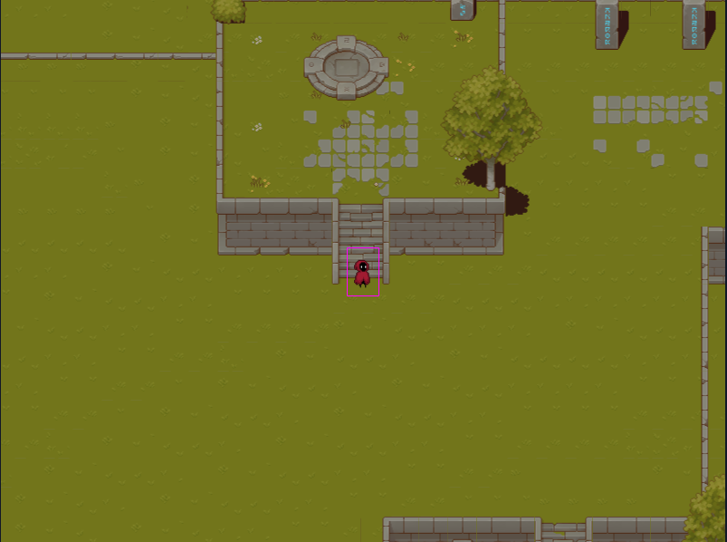
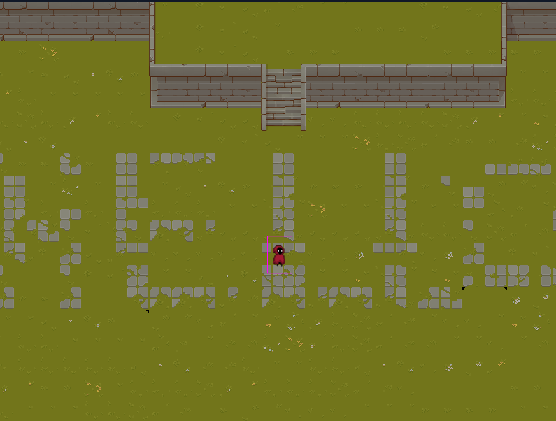
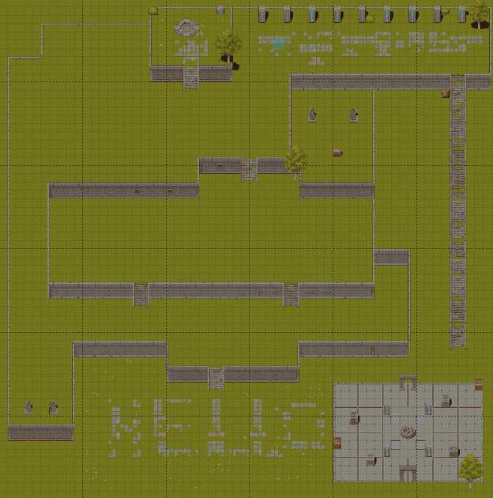
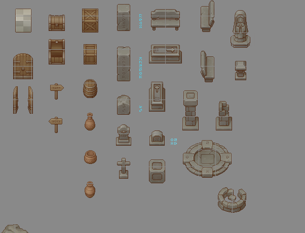
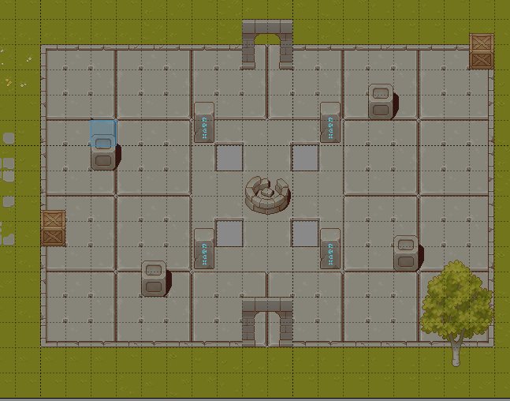
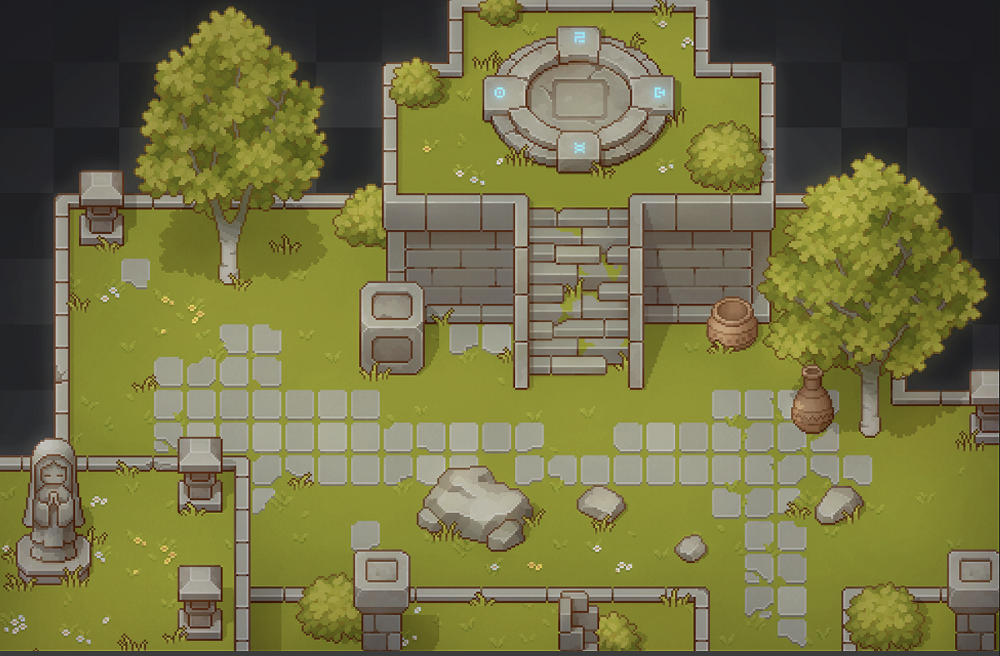

# 🎮 Interactive Portfolio Game (Phaser)

An interactive 2D portfolio built using **Phaser**, where users explore a game world to learn more about me, my projects, and my technical experience.

Instead of a traditional static website, this portfolio transforms my profile into a playable dungeon-style experience.

## 🌐 Live Demo
[(Demo)](https://my-portfolio-wheat-beta-56.vercel.app/)

---

## 🚀 Concept

This project reimagines a developer portfolio as a game.

Users can:
- Move through an interactive world
- Interact with objects to view projects
- Solve small puzzles
- Unlock achievements
- Explore sections like skills, experience, and contact

The goal is to combine **game development** and **web portfolio design** into one cohesive experience.

---

## 🧩 Features

- Top-down 2D exploration
- Interactive objects (project boards, NPCs, portals)
- Puzzle mechanics
- Achievement system
- Scene transitions
- Responsive UI overlays
- Clean modular scene architecture

---

## 🛠 Tech Stack

- **Phaser 3**
- **JavaScript / TypeScript**
- HTML5 Canvas
- Modular scene-based architecture
- Custom UI overlays

---

## 🎯 Why I Built This

I wanted my portfolio to reflect:

- My interest in game development
- My ability to design interactive systems
- My understanding of scene management and game architecture
- Creative thinking beyond traditional web portfolios

This project demonstrates both technical skills and product thinking.

---

## 🔮 Future Improvements

- More advanced puzzle mechanics
- Save system
- Procedural room layouts
- Better animations and VFX
- Sound design and music

---

## 📸 Screenshots

---

## 🧠 About Me

I am a developer focused on:
- Game development
- Full-stack engineering
- Interactive UI systems

This portfolio project represents my passion for building immersive digital experiences.

---

## 📜 License

MIT
